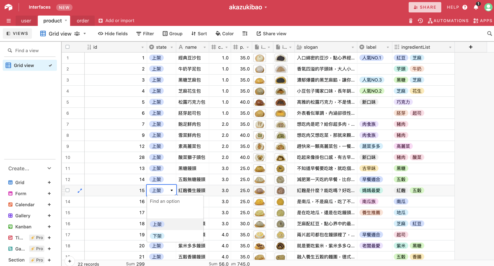

# Azukibao

This site is developed by [React.js](https://reactjs.org/), integrated third-party API from [Airtable](https://airtable.com/api) and [Instagram](https://developers.facebook.com/docs/instagram-api/).

### Description:

This is a Chinese bun branded website using Airtable as CMS. Client can easily manage products on online excel without any programming skills. In addition, by fetching Instagram API, instagram posts from official account will also update synchronously.

### Demo link:

https://azukibao.netlify.app/

### Screenshots




### Resource

- [Mockup](https://xd.adobe.com/view/4a8d6a5f-8cde-44c6-9019-3c3089f40534-1fde/grid)

### Technologies

- Base:
  - HTML / CSS / SCSS / JavaScript
- Framework:
  - [React.js](https://reactjs.org/)

#### Dependencies

- [styled-components](https://styled-components.com/)
- [axios](https://github.com/axios/axios)
- [aos](https://michalsnik.github.io/aos/)
- [swiper](https://swiperjs.com/)
- [node-sass](https://www.npmjs.com/package/node-sass)
- ... ( see `package.json` for details )

### Folder structure

```
    .
    ├── docs                         # documentation files
    ├── public                       # static files, like images, etc..
    ├── src
    │    ├── assets                  # media assets, like icons, etc..
    │    ├── components              # global components
    │    ├── hooks                   # utility hooks for encapsulating logic
    │    ├── pages
    │    │   ├── BrandPage
    │    │   │   ├── BrandHeroHeader.jsx
    │    │   │   ├── BrandStorySection.jsx
    │    │   │   └── index.jsx
    │    │   ├── HomePage
    │    │   │   └── ...
    │    │   ├── PopularPage
    │    │   │   └── ...
    │    │   ├── ShopPage
    │    │   │   └── ...
    │    │   ├── EmptyPage.jsx
    │    │   ├── MaterialPage.jsx
    │    │   └── ProductPage.jsx
    │    ├── styles                   # global styles (using BEM naming)
    │    ├── App.jsx                  # main components as App container
    │    ├── index.js                 # root entry point
    │    └── utils.js                 # tools and utilities
    ├── .gititnore
    ├── .jsconfig.json
    ├── package-lock.json
    ├── package.json
    └── README.md

```

### Style Folder structure

```
    styles
      ├── base
      │   ├── _base.scss
      │   ├── _reset.scss
      ├── components
      │   ├── _banner.scss
      │   └── ...
      ├── helpers
      │   ├── _variables.scss
      │   └── ...
      ├── layout
      │   ├── _footer.scss
      │   └── ...
      ├── plugin
      │   ├── aos.css
      │   └── swiper-bundle.scss
      ├── utilities
      │   ├── _spacing.scss
      │   └── ...
      └── all.scss                    # root style file

```

### Setup

- Download or clone the repository
- Install dependencies
  ```bash
  npm install
  ```
- Run the development server:

  ```bash
  npm run start
  ```

- Open [http://localhost:3000](http://localhost:3000) with your browser to see the homePage.

### Author

- UX / UI Design: [Wei Lin](https://github.com/WeiLin18)
- Web development: [Wei Lin](https://github.com/WeiLin18)
- Product Photography: [Wei Lin](https://github.com/WeiLin18)
